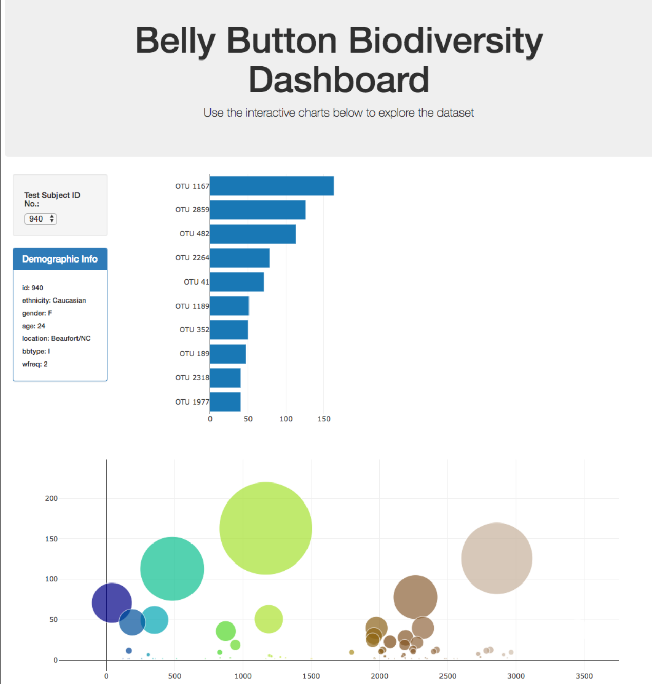

# Belly Button Biodiversity Interactive Dashboard

This interactive dashboard allows users to explore the Belly Button Biodiversity dataset, which catalogs the microbes that colonize human navels. The dashboard provides visualizations and information about the microbial species found in individual belly buttons.

## Table of Contents

- [Project Overview](#project-overview)
- [Actions Taken](#actions-taken)
- [Features](#features)
- [Deployment](#deployment)
- [Technologies Used](#technologies-used)
- [License](#license)

## Project Overview

The Belly Button Biodiversity Interactive Dashboard is built using D3.js and Plotly.js libraries to visualize a dataset. The main features of the dashboard include a horizontal bar chart, a bubble chart, and the display of sample metadata. Additionally, there is an optional advanced feature of a gauge chart to plot the weekly washing frequency of individuals.

## Actions Taken

To build and run the interactive dashboard locally, the following actions were taken:

1. **Repository Setup:** Created a new repository called "belly-button-challenge" for the project and cloned it to the local machine.

2. **Project Files:** Downloaded the Module 14 Challenge zip file and copied the necessary files from the "StarterCode" folder into the local repository. These files include:
   - index.html
   - samples.json
   - static/ (folder)

3. **GitHub and Deployment:** Committed the changes to the repository and pushed them to GitHub for version control. Deployed the repository to GitHub Pages to make the interactive dashboard accessible online.

4. **Data Reading with D3:** Utilized the D3 library to read in the samples.json file from the provided URL. This file contains the dataset required for the dashboard.

5. **Horizontal Bar Chart:** Created a horizontal bar chart using D3 and Plotly.js to display the top 10 operational taxonomic units (OTUs) found in an individual's belly button. The chart used sample_values as the values, otu_ids as the labels, and otu_labels as the hovertext.

6. **Bubble Chart:** Implemented a bubble chart using D3 and Plotly.js to visualize each sample. The chart utilized otu_ids for the x values, sample_values for the y values and marker size, otu_ids for the marker colors, and otu_labels for the text values.

7. **Sample Metadata Display:** Developed a section in the dashboard to display an individual's demographic information from the sample metadata. All key-value pairs from the metadata JSON object were shown on the page.

8. **Dynamic Updates:** Implemented dynamic updates for all the plots and displayed information. Ensured that selecting a new sample would update the charts and metadata display accordingly.

9. **Optional Advanced Feature - Weekly Washing Frequency Gauge:** Adapted the Gauge Chart from Plotly.js to plot the weekly washing frequency of individuals. Modified the gauge code to accommodate values ranging from 0 through 9. The gauge chart was updated dynamically upon selecting a new sample.

## Features

The Belly Button Biodiversity Interactive Dashboard provides the following features:

1. **Horizontal Bar Chart:** Displays the top 10 operational taxonomic units (OTUs) found in an individual's belly button. The bar chart uses sample_values as the values, otu_ids as the labels, and otu_labels as the hovertext.

2. **Bubble Chart:** Visualizes each sample by using the otu_ids for the x values, sample_values for the y values, sample_values for the marker size, otu_ids for the marker colors, and otu_labels for the text values.

3. **Sample Metadata Display:** Shows an individual's demographic information from the sample metadata. All key-value pairs from the metadata JSON object are displayed on the page.

4. **Dynamic Updates:** All the plots and displayed information are updated in real-time whenever a new sample is selected. Users can explore different individuals' data by selecting different samples.

## Deployment

The interactive dashboard is deployed using GitHub Pages. 

## Technologies Used

The following technologies and libraries were used to build the Belly Button Biodiversity Interactive Dashboard:

- HTML/CSS
- JavaScript
- D3.js
- Plotly.js

